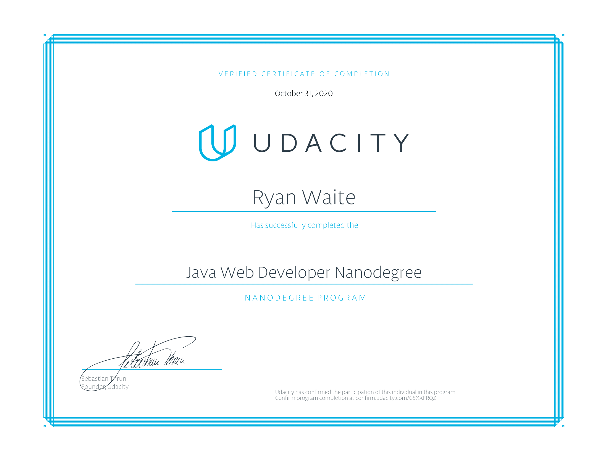

# Java Web Developer Nanodegree

<blockquote>
Learn enterprise scale back-end development with Java, and be prepared for the software engineering jobs that are in demand at a majority of Fortune 500 companies like Google, Amazon, Netflix, and more. Learn back-end development with the Java programming language, one of the most popular programming languages in the world and one a majority of large enterprises rely on for their infrastructure.
 
 
Why take this Nanodegree program?
 
Java has been one of the most popular programming languages in the world for over 20 years, and most Fortune 500 companies rely on Java for their back-end architecture. In this program, you’ll learn to build, test, and deploy back-end infrastructure(s) using Java, and complete real-world projects to share with current or prospective employers to demonstrate mastery of the skills that are in high-demand at a wide range of companies. According to Glassdoor, Java developers had some of the fastest growing salaries in 2018

- Udacity.com
</blockquote>

## Spring Boot Basics
Learn the fundamentals of Java while being introduced to a Spring Boot framework and associated integrations and plugins.
* Project: BUILD A WEB-BASED PERSONAL STORAGE APPLICATION

Web Services and APIs
Explore the differences between web services, APIs, and microservices. Develop REST and GraphQL APIs, and learn how to secure, consume, document, and test those APIs and web services.
* Project: BUILD THE BACK-END SYSTEM FOR A CAR WEBSITE

## Data Stores & Persistence
Build applications that read and write to relational databases using both the Java Persistence API (JPA) and SQL. Use standard design patterns to make your persistence layer easy to test and integrate with a Spring Boot application
* Project: DESIGN THE DATA MODEL FOR A SAAS APPLICATION

## Security and DevOps
Learn about Git, version control, and best practices for authorization and authentication. Use Jenkins to build a CI/CD pipeline to deploy code to production.
* Project: IMPLEMENT AUTHORIZATION FOR AN ECOMMERCE APPLICATION

 
 

## Ryan M. Waite